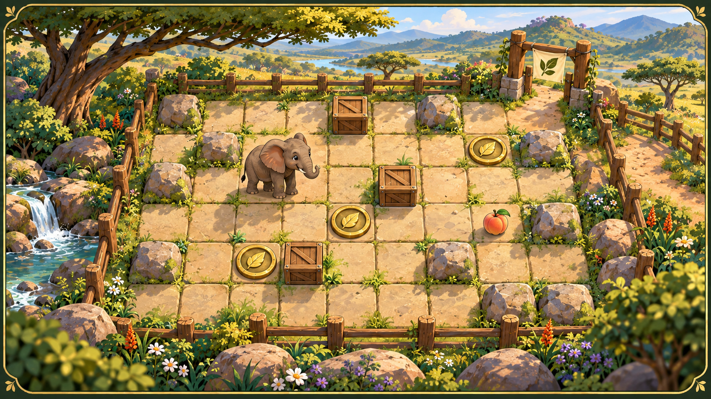
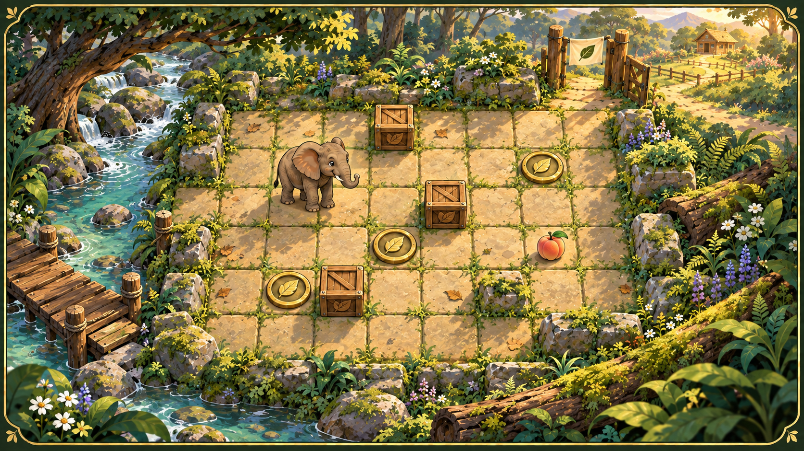

# Veda's Great Escape — richer board concepts

Created 2026-09-21 as visual exploration. Jobe subsequently selected the painted
diorama direction for a local production migration. The puzzle layouts,
mechanics, saves, rewards and publication state remain fixed; implementation is
governed by root [plan 56](../../../../plans/56-veda-painted-diorama-migration.md).

## Painted diorama board

A shallow handcrafted sanctuary diorama with stone grid tiles, warm timber,
painted foliage and crisp character/prop silhouettes. **Selected production
direction.** The implementation translates this target into layered sprites,
tiles and scenery rather than using the flattened concept as a game board.

## Storybook trail board

A less glossy, more painterly illustrated-book direction. **Unselected and
retained for history.** A stream, mossy walls,
fallen timber and sanctuary gate make the fixed grid feel like a place while
keeping the same discrete route-planning grammar.

## Shared migration constraints

- Preserve the authored 9×7 puzzle layouts and all current interactions.
- Replace emoji presentation without reducing phone-size readability.
- Keep Veda, crates, switches, peaches, walls and the exit visually distinct.
- Preserve the forest-green, moss, ochre, peach, cream and muted-teal palette.
- Treat the concepts as visual targets, not literal asset sheets; production art
  would need separated sprites, tile variants, interaction states and responsive
  crops.

Both images were generated with the built-in image-generation workflow, using
the existing sanctuary painting only as a palette, setting and quality reference.

Phase 1's local production atlases, normalized crop contract, exact prompts and
alpha inspection notes are recorded in [asset provenance](asset-provenance.md).
The retained [native-size 3×3 terrain repeats](terrain-repeat-3x3-native.png)
and [approximately 43px-cell repeats](terrain-repeat-3x3-phone.png) verify the
final wrap-offset seam correction at both inspection scales.

The local migration is implemented in the strict TypeScript/OOP package at
`application/packages/game-vedas-great-escape`, revision 1.1.0. Phase 4's
automated, browser and limitation record is in the [verification receipt](../../veda-painted-diorama-verification.md).
No hosted output changed.
